# MCP Server on AWS with CDK

A production-ready implementation of the Model Context Protocol (MCP) server deployed on AWS using CDK, featuring secure private VPC architecture, AI integration with Amazon Bedrock, and a modern React frontend.

## 🏗️ Architecture Overview

This project implements a pure MCP (Model Context Protocol) server with HTTP bridge for browser compatibility, deployed on AWS using a secure private VPC architecture.

```mermaid
graph TB
    subgraph "External"
        User[👤 User]
        Browser[🌐 Web Browser]
    end
    
    subgraph "AWS Account"
        subgraph "VPC (10.0.0.0/16)"
            subgraph "Public Subnet (10.0.1.0/24)"
                ALB[🔄 Application Load Balancer]
                NAT[🚪 NAT Gateway]
            end
            
            subgraph "Private Subnet (10.0.2.0/24)"
                subgraph "ECS Fargate Cluster"
                    MCPServer[📡 MCP Server Container<br/>FastAPI + MCP Bridge<br/>Port 8000]
                    Frontend[⚛️ React Frontend<br/>Material-UI + Vite<br/>Port 3000]
                end
            end
        end
        
        subgraph "AWS Services"
            DynamoDB[(🗄️ DynamoDB<br/>mcp-items table)]
            Bedrock[🤖 Amazon Bedrock<br/>AI Models]
            CloudWatch[📊 CloudWatch Logs]
        end
    end
    
    User --> Browser
    Browser --> ALB
    ALB --> Frontend
    ALB --> MCPServer
    MCPServer --> DynamoDB
    MCPServer --> Bedrock
    MCPServer --> CloudWatch
    Frontend --> CloudWatch
    
    classDef aws fill:#ff9900,stroke:#333,stroke-width:2px,color:#fff
    classDef private fill:#e1f5fe,stroke:#01579b,stroke-width:2px
    classDef public fill:#f3e5f5,stroke:#4a148c,stroke-width:2px
    classDef external fill:#c8e6c9,stroke:#1b5e20,stroke-width:2px
    
    class ALB,NAT,DynamoDB,Bedrock,CloudWatch aws
    class MCPServer,Frontend private
    class User,Browser external
```



## 🔧 MCP Protocol Flow

The system implements the Model Context Protocol with an HTTP bridge for browser compatibility:


## 🛠️ Technology Stack

### Backend (MCP Server)
- **MCP Protocol**: Official Model Context Protocol implementation
- **FastAPI**: HTTP bridge for browser compatibility
- **Amazon Bedrock**: AI model integration (Titan, Claude)
- **DynamoDB**: NoSQL database for item storage
- **Python**: Core server implementation

### Frontend
- **React 18**: Modern UI framework
- **Material-UI (MUI)**: Component library
- **Vite**: Fast build tool
- **MCP Client**: Direct MCP protocol communication

### Infrastructure (AWS CDK)
- **ECS Fargate**: Serverless container platform
- **Application Load Balancer**: Traffic routing and SSL termination
- **VPC**: Secure private network with public/private subnets
- **DynamoDB**: Managed NoSQL database
- **CloudWatch**: Logging and monitoring
- **IAM**: Fine-grained access control

## 🔐 Security Features

### Network Security
- **Private VPC**: All application resources in private subnets
- **Security Groups**: Restrictive firewall rules
- **NAT Gateway**: Outbound internet access for private resources
- **ALB**: Public-facing load balancer with health checks

### Access Control
- **IAM Roles**: Fine-grained permissions for ECS tasks
- **Service-to-Service**: Secure communication between components
- **No Public IPs**: Application containers have no direct internet access

### Data Protection
- **DynamoDB Encryption**: Data encrypted at rest
- **CloudWatch Logs**: Centralized, secure logging
- **VPC Endpoints**: Private AWS service communication (optional)

## 📁 Project Structure

```
mcp-server-cdk-package/
├── lib/
│   └── mcp-server-stack.ts          # CDK infrastructure definition
├── mcp-server/
│   ├── main.py                      # MCP server + HTTP bridge
│   ├── requirements.txt             # Python dependencies
│   └── Dockerfile                   # Container configuration
├── simple-frontend/
│   ├── src/
│   │   └── App.jsx                  # React MCP client
│   ├── package.json                 # Frontend dependencies
│   └── Dockerfile                   # Container configuration
├── bin/
│   └── mcp-server-cdk-package.ts   # CDK app entry point
├── cdk.json                         # CDK configuration
└── README.md                        # This file
```

## 🛠️ Prerequisites

- Node.js 18 or later
- AWS CLI configured with appropriate credentials
- Docker (for local development)
- AWS CDK CLI (`npm install -g aws-cdk`)

## 🚀 Quick Start

### 1. Clone and Setup

```bash
git clone <repository-url>
cd mcp-server-cdk-package
npm install
```

### 2. Deploy to AWS

```bash
# Bootstrap CDK (first time only)
cdk bootstrap

# Deploy the entire stack
cdk deploy
```

### 3. Access Your Application

After deployment, you'll see outputs with URLs:
- **Application URL**: Main frontend application
- **MCP API**: Backend MCP protocol endpoint
- **Health Check URL**: Backend health status

## 🏗️ Deployment Architecture

```mermaid
graph LR
    subgraph "Development"
        Dev[👨‍💻 Developer]
        CDK[📦 CDK Code]
    end
    
    subgraph "CI/CD Pipeline"
        Deploy[🚀 cdk deploy]
        Build[🔨 Container Build]
    end
    
    subgraph "AWS Production"
        ECR[📦 ECR Registry]
        ECS[🐳 ECS Services]
        ALB[⚖️ Load Balancer]
        Apps[📱 Applications]
    end
    
    Dev --> CDK
    CDK --> Deploy
    Deploy --> Build
    Build --> ECR
    ECR --> ECS
    ECS --> ALB
    ALB --> Apps
```



## 🎯 Key Features

### MCP Protocol Implementation
- **Pure MCP**: Full Model Context Protocol compliance
- **HTTP Bridge**: Browser-compatible JSON-RPC 2.0 over HTTP
- **Tool Execution**: Create, read, update, delete database items
- **Resource Access**: List and read data sources
- **AI Integration**: Bedrock-powered intelligent command processing

### AI Agent Capabilities
- **Natural Language**: Process user commands in plain English
- **Action Execution**: Parse commands and execute MCP tool calls
- **JSON Output**: Structured action directives for reliable execution
- **Error Handling**: Graceful error responses and user feedback

### Production Ready
- **Auto Scaling**: ECS Fargate with configurable scaling
- **Health Checks**: ALB health monitoring
- **Logging**: Comprehensive CloudWatch integration
- **Monitoring**: Container and application metrics

## 🛠️ Available MCP Tools

| Tool | Description | Parameters |
|------|-------------|------------|
| `create_item` | Create new database item | `name`, `description`, `category`, `metadata` |
| `list_items` | List all database items | `limit` (optional) |
| `get_item` | Get specific item by ID | `item_id` |
| `delete_item` | Delete item by ID | `item_id` |
| `bedrock_chat` | AI agent with action execution | `message`, `model_id` (optional) |
| `bedrock_analyze_items` | AI analysis of database items | `analysis_type`, `model_id` (optional) |

## 📊 Available MCP Resources

| Resource | Description | Data Format |
|----------|-------------|-------------|
| `items://all` | All database items | JSON array |
| `bedrock://models` | Available Bedrock models | JSON array |

## 📝 API Documentation

### MCP HTTP Bridge Endpoints

- **POST /mcp**: MCP protocol messages (JSON-RPC 2.0)
- **GET /health**: Health check endpoint
- **GET /docs**: FastAPI auto-generated documentation

### MCP Protocol Methods

- `tools/list`: List available tools
- `tools/call`: Execute a tool with parameters
- `resources/list`: List available resources
- `resources/read`: Read resource content

## 🔧 Local Development

### Run MCP server locally
```bash
cd mcp-server
pip install -r requirements.txt
python main.py
```

### Run frontend locally
```bash
cd simple-frontend
npm install
npm run dev
```

### Docker Development

```bash
# Build and run backend
cd mcp-server
docker build -t mcp-server .
docker run -p 8000:8000 mcp-server

# Build and run frontend
cd simple-frontend
docker build -t mcp-frontend .
docker run -p 3000:3000 mcp-frontend
```

## 🎓 Usage Examples

### Direct MCP Protocol
```javascript
// List available tools
const tools = await mcpClient.listTools();

// Create an item
const result = await mcpClient.callTool('create_item', {
  name: 'My Item',
  description: 'Item description',
  category: 'test'
});
```

### AI Agent Commands
```
"create an item called laptop with description work computer"
"list all items"  
"delete item abc-123-def"
"analyze all items for insights"
```

## 🛡️ Security Considerations

### Network Security
- Private subnets for all application components
- Security groups with minimal required access
- NAT Gateway for outbound internet access
- No direct public IP assignment to containers

### IAM Permissions
- Principle of least privilege
- Service-specific roles and policies
- No hardcoded credentials

### Data Security
- DynamoDB encryption at rest
- CloudWatch logs encryption
- VPC flow logs (optional)

## 📈 Monitoring & Logging

### CloudWatch Logs
- MCP Server: `/ecs/mcp-server`
- Frontend: `/ecs/frontend`
- Retention: 7 days

### Health Checks
- ALB Health Check: `/health` endpoint
- Container Health: ECS task health monitoring
- Database Health: DynamoDB connection validation

## 🧪 Testing

### Test MCP Protocol

```bash
# Health check
curl http://your-alb-url/health

# List MCP tools
curl -X POST http://your-alb-url/mcp \
  -H "Content-Type: application/json" \
  -d '{"jsonrpc": "2.0", "id": "1", "method": "tools/list"}'

# Create an item via MCP
curl -X POST http://your-alb-url/mcp \
  -H "Content-Type: application/json" \
  -d '{"jsonrpc": "2.0", "id": "2", "method": "tools/call", "params": {"name": "create_item", "arguments": {"name": "Test Item", "description": "A test item", "category": "test"}}}'
```

### Test AI Agent

```bash
curl -X POST http://your-alb-url/mcp \
  -H "Content-Type: application/json" \
  -d '{"jsonrpc": "2.0", "id": "3", "method": "tools/call", "params": {"name": "bedrock_chat", "arguments": {"message": "create an item called laptop"}}}'
```

## 🔄 CI/CD Pipeline

The project supports automated deployment through:
- **CDK Deploy**: `cdk deploy` for infrastructure updates
- **Container Updates**: ECS service updates with zero downtime
- **Health Checks**: Automated rollback on failed deployments

### Cleanup

Clean removal of all AWS resources:
```bash
cdk destroy
```

## 🔧 Configuration

### Environment Variables
- `DYNAMODB_TABLE_NAME`: DynamoDB table name (default: `mcp-items`)
- `AWS_DEFAULT_REGION`: AWS region (default: `us-east-1`)
- `NODE_ENV`: Node environment (default: `production`)

### CDK Configuration
- VPC CIDR: `10.0.0.0/16`
- Container Resources: 256 CPU, 512 MB memory
- Auto Scaling: 1-10 tasks based on CPU/memory utilization

## 🚨 Troubleshooting

### Common Issues

1. **CDK Bootstrap Error**: Run `cdk bootstrap` manually
2. **Docker Build Issues**: Ensure Docker is running
3. **Permission Errors**: Check AWS IAM permissions
4. **Port Conflicts**: Use different ports for local development

### Logs

Check CloudWatch logs:
- `/ecs/mcp-server` - Backend logs
- `/ecs/frontend` - Frontend logs

## 🎨 Frontend Features

- **Modern UI**: Clean, responsive design with Material-UI
- **MCP Protocol**: Direct MCP communication via HTTP bridge
- **AI Chat**: Interactive AI agent with natural language commands
- **Item Management**: Full CRUD operations via MCP tools
- **Real-time Updates**: Automatic refresh after AI actions
- **Responsive**: Works on desktop and mobile devices

## 🛡️ Production Considerations

- Add SSL certificates for HTTPS
- Configure custom domain names
- Set up backup strategies for DynamoDB
- Implement monitoring and alerting
- Add authentication and authorization
- Configure WAF for additional security

## 🤝 Contributing

1. Fork the repository
2. Create a feature branch
3. Make your changes
4. Test thoroughly
5. Submit a pull request

## 📄 License

This project is licensed under the MIT License - see the LICENSE file for details.

## 📞 Support

For issues and questions:
- Create an issue in the repository
- Check the troubleshooting section
- Review AWS CloudWatch logs

---

🎉 **Happy coding with your MCP Server!** 🎉